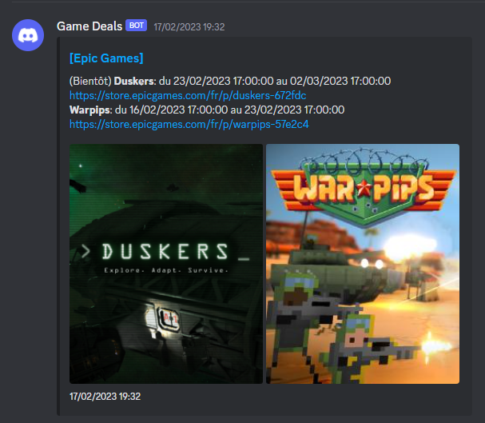

# Epic Games free games tracker

Checks the Epic Games store api for free games and sends webhook when it finds one

Send a webhook similar to the following:


## Table of contents

- [Epic Games free games tracker](#epic-games-free-games-tracker)
  - [Table of contents](#table-of-contents)
  - [Requirements](#requirements)
  - [Usage](#usage)
  - [Environment](#environment)
  - [Example using a cronjob and nvm](#example-using-a-cronjob-and-nvm)
    - [License](#license)

## Requirements

- node@>=23

## Usage

First, clone the repo via git and install dependencies

```bash
git clone https://github.com/KosmoMoustache/epic_games_free_games.git
pnpm install
```

Then, run the project

```bash
node ./src/index.ts
```

## Environment

| Key         | Default value (if any) | Description                                                                                                                                                            |
| ----------- | ---------------------- | ---------------------------------------------------------------------------------------------------------------------------------------------------------------------- |
| WEBHOOK_URL | REQUIRED               | The webhook url                                                                                                                                                        |
| UPTIME_URL  | not defined            | The URL to monitor the application's uptime.used.                                                                                                                      |
| LOG_LEVEL   | info                   | The log level. Accept `debug`, `info`, `warn` and `error`.                                                                                                             |
| USE_CACHE   | false                  | If the application should use a file (./freeGamesPromotions.json) as the api instead of calling epic games' server. Should only be used when testing and/or developing |

## Example using a cronjob and nvm

```crontab
0 17 * * * export NODE_ENV='production'; export PATH_TO='path/to/the/project'; cd $PATH_TO; (. ./crontab.en.sh; ./start.sh >> $PATH_TO/logs/cron-`date +\%Y-\%m`.log; )
```

### License

[GNU General Public License v3.0 © (gpl-3.0)](https://github.com/KosmoMoustache/epic_games_free_games/blob/main/LICENSE)
